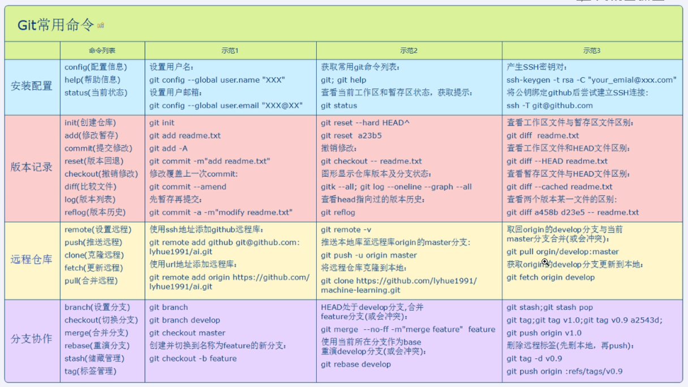

# 测试MarkDown

## 测试1

### 区块引用

>测试
>>测试
>>>测试

---

### 代码框

`public String str = "";`

```java
//代码测试
private void OnQuerySelect(View view) {
   initDialog(getContext(), R.layout.setting_info_dialog, recyclerViewData);
}
```

---

### 列表

* 测试1
* 测试2
* 测试3

---

1. 测试1
2. 测试2
3. 测试3

---

1. 测试1
2. 测试2
3. 测试3

---

### 图片


