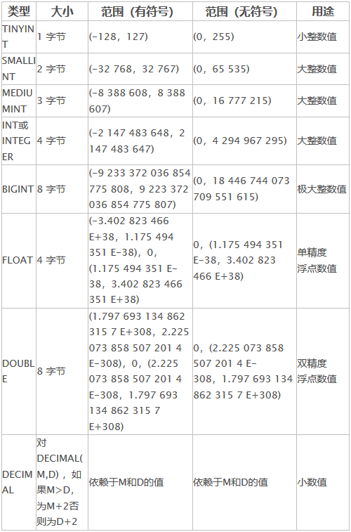
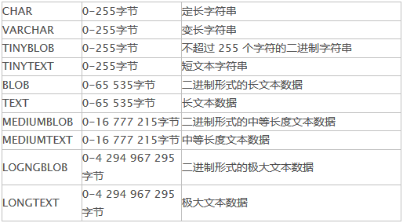
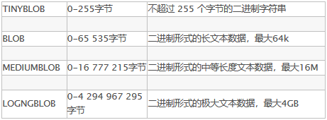
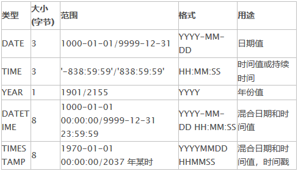

# MySql笔记

## 存储类型

### 常见存储类型

1.**数字型**

2.**字符类型**

3.**枚举集合类型**
ENUM （最多65535个成员） 64KB
SET  （最多64个成员）    64KB
4.**二进制数据类型**

5.**时间类型**

### 存储类型的长度

MySql有多种数据类型可以存储，有些数据类型可以限制类型的“长度”，然而，这个数据类型的长度并不是指数据的大小。具体分情况来说：

1. CHAR、VARCAHR的长度是指**字符的长度**，例如CHAR[3]则只能放字符串"123"，如果插入数据"1234"，则从高位截取，变为"123"。 VARCAHR同理。
2. TINYINT、SMALLINT、MEDIUMINT、INT和BIGINT的长度，其实和数据的大小无关！Length指的是**显示宽度**，举个例子：int(3) 为显示为3位 存数字1  则显示为 001(需要定义为zerofill，否则显示的是1，看不出显示宽度)
3. FLOAT、DOUBLE和DECIMAL的长度指的是**全部数位（包括小数点后面的）**，例如DECIMAL(4,1)指的是全部位数为4，小数点后1位，如果插入1234，则查询的数据是999.9
